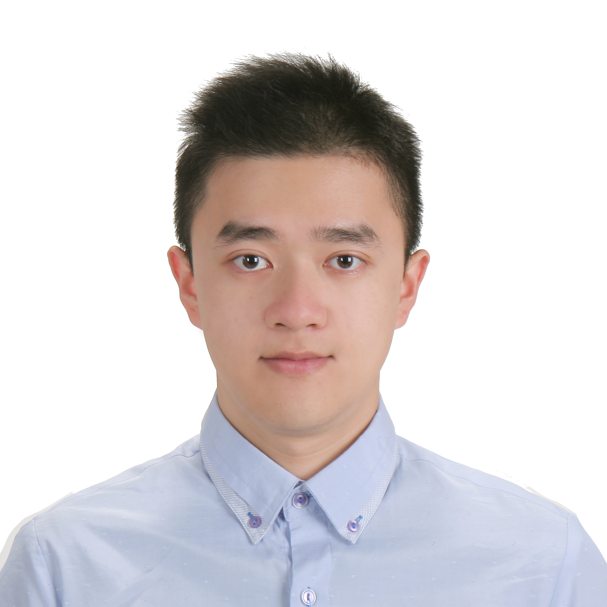

  

We are a rag-tag bunch that was formed during our first semester as candidates of MS Biostatistics at Columbia University. We are happy to be in Professor Jeff Goldsmith's P8105 data science class where this project was started. 

  

# Bryan Bunning

I'm Bryan and my professional interests include clinical trial methodology, patient centered outcomes, and data science. I spent the last few years working in an immunology lab focused on pediatric food allergy and asthma. I performed various immunophenotyping experiments for phase 1-3 clinical trials, which is where/how I found my passion for this area of research!

  

# Yuanzhi (Fisher) Yu

My name is Yuanzhi Yu (Fisher) and I'm from from China! 

You can learn more about me here [Fisher](https://yy3019.github.io/Resume.html)

  

# Zongchao (Adobe) Liu

I received a BS in Medical Science from Shandong University in 2019 and currently study biostatistics in Mailman School of Public Health, Columbia University. I am passionate about the field of biomedical engineering and health data science. I am also interested in applications of the wearable sensors in healthcare and computational epidemiology. You may learn more about me from [here](https://zl2860.github.io/)

  

# Wangchia (Gavin) Ko

Hi, I'm Gavin Ko from Taiwan! I'm currently pursuing a career in healthcare consulting industry, and RCTs are such a huge information source in this area. However, I was stunned by the fact that these million-dollar-costing researches were so statistically vulnerable. When I heard Bryan and Kevin discussing about this project, I immediately asked if I can take part in such a fascinating topic. The knowledge of RCTs and FI we've accumulated through this project would definitely facilitate my future critical thinking and interpretation skills as a consultant. 

  

# Kevin S. Wongsodirdjo

My name is Kevin and I'm from Indonesia! My dream is to eventually be a physician and for that goal, I studied biochemistry as an undergraduate in University of Washington. I got into Columbia's Biostatistics program after a mentor taught me the things you can do with data. I believe that learning about data, wrangling, and analysis will significantly help my future decision-making as a physician. I decided to join this project after Bryan explained the significance of FI. Though it's not the perfect tool to assess the validity of statistical tests, FI bridges the gap of what truly matters to physicians and statisticians. We hope that this project may find something useful for the scientific community. 
  

# Pikachu

Our one and only mascot. Just like Ash's pikachu, our team is tenacious, loyal, energetic, and unyielding. We take care of each other and though we speak different native languages, we understand each other because our mind are as one.

  