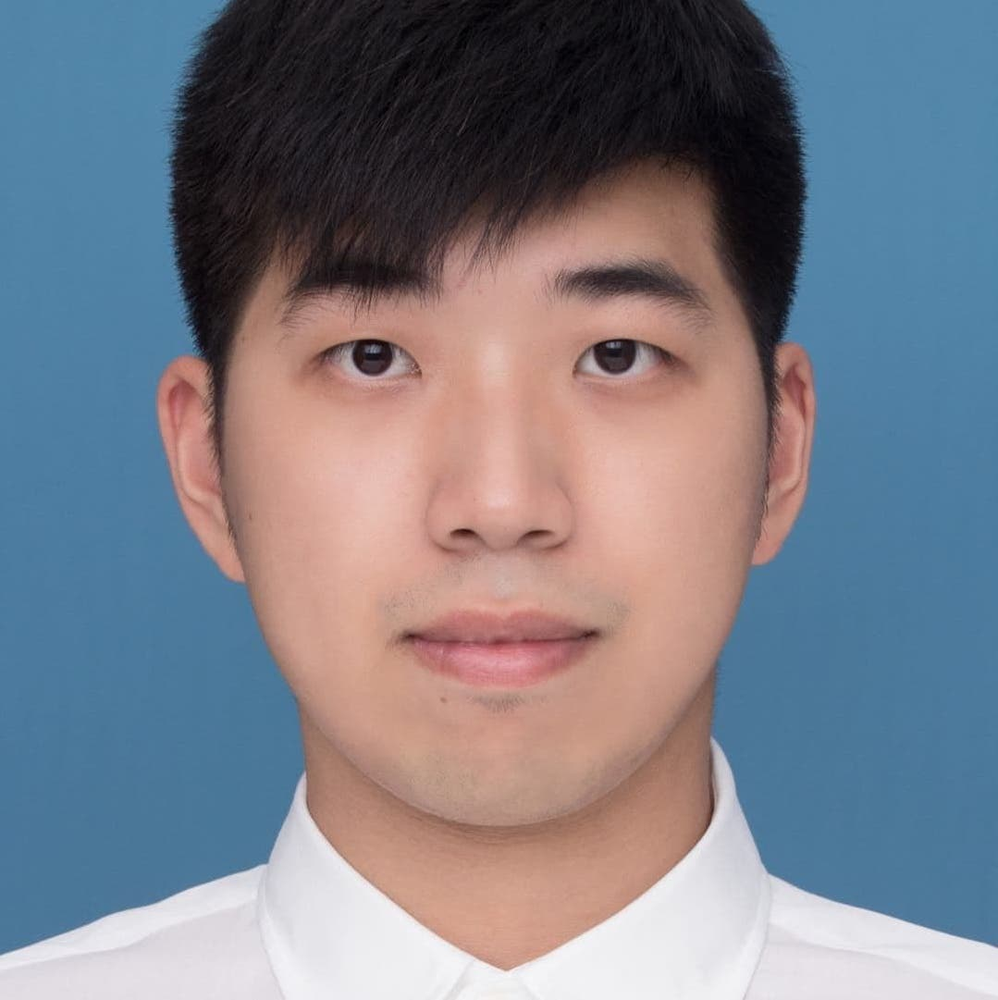

  

We are a rag-tag bunch that was formed during the hellish classes in the first semester of our lives as candidates of MS Biostatistics at Columbia University. What started out as friendly competition in P8105 class under Professor Jeff Goldsmith's tutelage. 

  

# Bryan Bunning

Content

  

# Yuanzhi (Fisher) Yu

Content

  

# Zongchao (Adobe) Liu

Content

  

#  Gavin (Wang...) Ko

Content

  

# Kevin S. Wongsodirdjo

My name is Kevin and I'm from Indonesia! My dream is to eventually be a physician and for that goal, I studied biochemistry as an undergraduate in University of Washington. I got into Columbia's Biostatistics program after a mentor taught me the things you can do with data. I believe that learning about data, wrangling, and analysis will significantly help my future decision-making as a physician. I decided to join this project after Bryan explained the significance of FI. Though it's not the perfect tool to assess the validity of statistical tests, FI bridges the gap of what truly matters to physicians and statisticians. We hope that this project may find something useful for the scientific community. 
  

# Pikachu

Our one and only mascot. Just like Ash's pikachu, our team is tenacious, loyal, energetic, and unyielding. Though we may seem unapproachable, we are actually tender at heart. We take care of each other and though we speak different native languages, we understand each other because our mind are as one. Most of all though, we're all cute as heck!

  