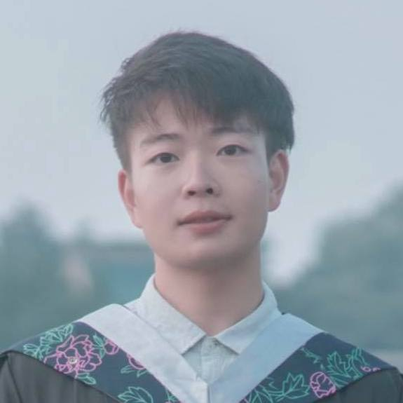
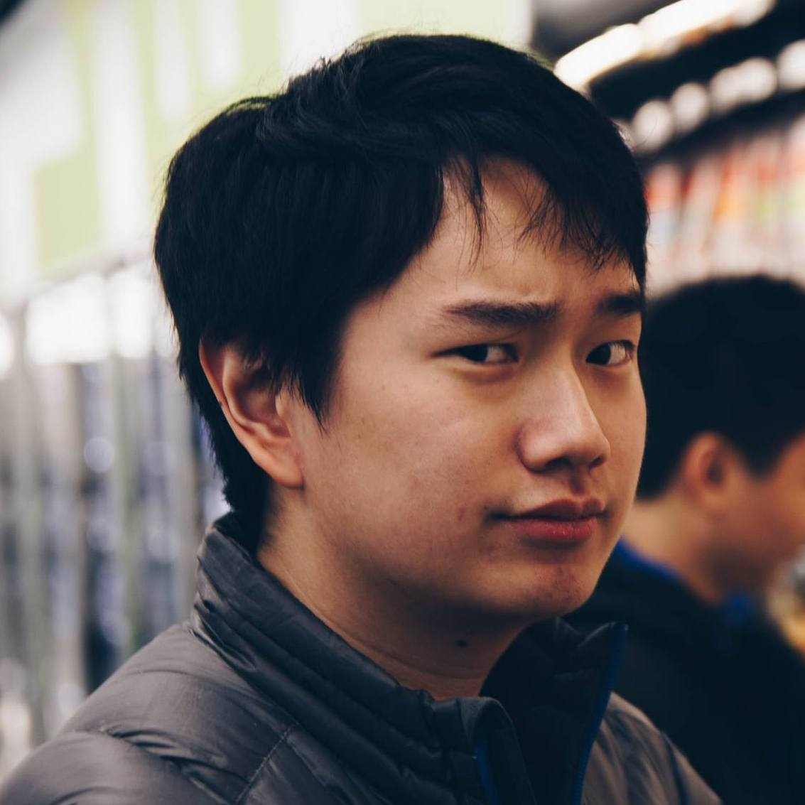
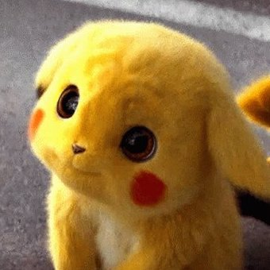

  

# Bryan Bunning

Content

  

# Yuanzhi (Fisher) Yu

Content

  

# Zongchao (Adobe) Liu

Content

  

#  Gavin (Wang...) Ko

Content

  

# Kevin S.W. 

My name is Kevin S.W. and I'm from Indonesia. My dream is to eventually be a physician and for that goal, I studied biochemistry as an undergraduate in University of Washington. I then worked a bit in clinics to expose myself to healthcare and during that time, I met a mentor who taught me things about data, which led me to pursuing biostatistics in Columbia University. I believe that learning about data, wrangling, and analysis will significantly help my future decision-making as a physician. If not, it is still a super cool skill to have! Below you will find a brief summary of my "achievements" up until this point. You can check my [LinkedIn](https://www.linkedin.com/in/kwongso/) to see more details.
  

# Our Mascot: Pikachu

Just like Ash's pikachu, our team is tenacious, loyal, energetic, and unyielding. Though we may seem unapproachable, we are actually tender at heart. We take care of each other and though we speak different native languages, we understand each other because our mind are as one. Most of all though, we're all cute as heck!

  