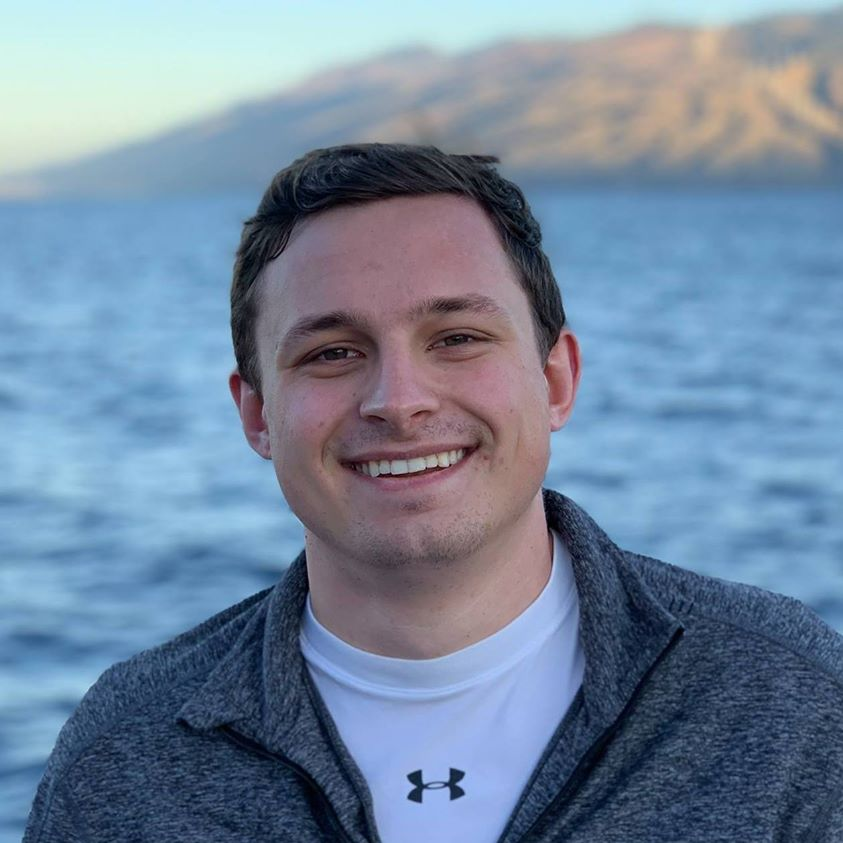

  

# Bryan Bunning

Content

  

# Yuanzhi (Fisher) Yu

Content

  

# Zongchao (Adobe) Liu

Content

  

#  Gavin (Wang...) Ko

Content

  

# Kevin S.W. 

My name is Kevin S.W. and I'm from Indonesia. My dream is to eventually be a physician and for that goal, I studied biochemistry as an undergraduate in University of Washington. I got into Columbia's Biostatistics program after a mentor taught me the things you can do with data. I believe that learning about data, wrangling, and analysis will significantly help my future decision-making as a physician. I joined this project after Bryan explained the significance of FI. I decided to join the group out of pure interest in the hopes that we could find something useful for the scientific community. 
  

# Pikachu

Our one and only mascot. Just like Ash's pikachu, our team is tenacious, loyal, energetic, and unyielding. Though we may seem unapproachable, we are actually tender at heart. We take care of each other and though we speak different native languages, we understand each other because our mind are as one. Most of all though, we're all cute as heck!

  