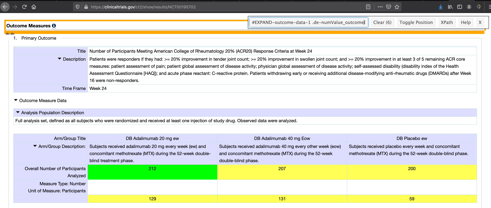

```{r setup, include = FALSE, message = FALSE, warning = FALSE}

# global default settings for chunks
knitr::opts_chunk$set(echo = TRUE, warning = FALSE, message = FALSE,
                      fig.width = 10, 
                      fig.align = "center"
                      )

# loaded packages; placed here to be able to load global settings

Packages <- c("tidyverse", "dplyr", "rvest", "httr", "XML", "readxl", "fragilityindex")
invisible(lapply(Packages, library, character.only = TRUE))

# global settings for color palettes
options(
  ggplot2.continuous.colour = "viridis",
  ggplot2.continuous.fill = "viridis"
)
scale_colour_discrete = scale_colour_viridis_d
scale_fill_discrete = scale_fill_viridis_d

# theme global setting for ggplot
theme_set(theme_minimal() + 
            theme(legend.position = "bottom") +
            theme(plot.title = element_text(hjust = 0.5, size = 12),
                  plot.subtitle = element_text(hjust = 0.5, size = 8))
          )

```

# Motivation

Our motivation behind this project is to explore the fragility index (FI) beyond what those involved in clinical trials have done. FI has been suggested as an easy-to-understand metric that bridges the intent of researchers and utilization by clinicians. It has growing interest in the oncology community but we want to explore its utility beyond this scope. You can go [here](proj_background.html) to learn more about our motivation. 

**Note:** You can expand our code chunks by clicking on `code` on the right pill-button.

<br></br>

### Primary Goals
* Explore general trend of FI in recent phase III clinical trials   
* Construct a web-based FI calculator which allows user to input their own dataset       
* Discover potential impact factors on FI. e.g. disease type, treatment type, conducted location

### Secondary Goals

* Explore other variables
* Use available data the best we can to synthesize information about clinical trials

<br></br>

# Related work

Our study is inspired mainly by three researches. First of all, the [Walsh study](https://www.jclinepi.com/article/S0895-4356(13)00466-6/abstract) has general introduction on Fragility Index and methodology behind. The author also provided an example of utilizing FI to evaluate the roubustness of a set of 399 eligible clinical trials.      
[Another study](https://jamanetwork.com/journals/jamasurgery/fullarticle/2712857?fbclid=IwAR0bb9aN2gwCOFd-HLF-DFOmT60wBtziuFZ_CKdxIu-y40eXYb9GKa8LhcU) done by Tignanelli also acknowleged FI as crucial part to be reported in further trama/ surgical RCT studies.       
Lastly, the [Del Paggio study](https://www.thelancet.com/journals/lanonc/article/PIIS1470-2045(19)30338-9/fulltext) revealed a trembling fact that many of the FDA-approved phase III clinical studies had a low FI; some of them were even 1% or less of their respective sample size. These materials serve as the inspiration of our topic.

<br></br>

# Initial Questions

As our initial goal, we want to find the relationship between fragility index and disease type in phase III RCT. To be more specific, we want to see if there's significant difference in FI between trials targeting cancers and those targeting non-oncology immunologic disorders. Also, we would like to discover any other facotrs that may impact the FI of RCT studies. However, during the data collection process, we found out that all the criterias we'd applied would result in insufficient sample size to conduct further analysis. Accordingly, we've enlarged our filtering criteria to US based phase III clinical trials.

## What actually happened

### The reality of our fragility index data

What we ended up actually doing differed from our initial hypothesis described in the above paragraph. After looking at the data we were able to gather, the questions we initially posed were not answerable. While we were able to scrape clinical trial information usable to calculate the fragility index, we did not have enough trials to make visualizations or really anything in our initial query which was filtered by drug type and disease type. 

So we pivoted and instead **scraped data from 10,000 completed phase 3 clinical trials prior to 2017**. This took a lot of trial and error, and the various methods we attempted can be found in the *obtaining data* section. We ended up scrapping **620???** trials that matched out criteria.

Questions we could answer from this dataset include:

1) What is the median fragility index of our data using our MacGyvered scraping method?
2) What sort of trends, if any, do we see from basic information describing the trials?

### Quest for ~~more~~ all data

The dataset we collected above was light in the sense that our scraping method did not gather other descriptive information. We needed more data to allow us to graph information required for this project. Here, we pivoted, again, to look at phase III clinical trials more generally. Our group members are interested in clincial trials, which despite their importance to US healthcare seem very shrouded in mystery. The fragility index was a very pointed question in this area of our healthcare system we do not know much about. There is a lot of general information about trials unknown to our group which might be interesting to look at.

So, to supplement our data scraping of clinical trial data, we decided instead to download **every clinical trial from clinicaltrials.gov**. This included a 800mb csv including descriptive information about each trial. This dataset was quite large, and crashed multiple members computers multiple times.

There were many questions which we could answer with this data, although it is not about the fragility index at all, and instead gave us a glimpse about what was generally going on in the field. We performed exploratory data analysis to look at what sort of questions we could answer including:

1) Where are clinical trials being done in the United States?
2) How many trials are done per year? Has it changed much year to year?
3) Who sponsors clinical trials?
4) Other interesting tidbits


<br></br>

# Obtaining Data

Our goal is to obtain data from clinical trials which is capable of calculating a fragility index in addition to any other information we may be able to easily gather. We attempted multiple methods to find such data.

### Attempt to Scrape from Google Scholar

Given the ease of access to Google Scholar (GS), we first attempted to scrape our sources from the site. We initially did this manually by searching some random entry in order to see a pattern where we can insert our "page number". We found that we need to split Google's search address into two partitions so that we can insert the search numbers. 

```{r gs_scrape}

# have to split link into 2 parts...
gs_url_base1 <- "https://scholar.google.com/scholar?start="
gs_url_base2 <- "&q=monoclonal+antibody+phase+3&hl=en&as_sdt=0,33&as_ylo=2007&as_yhi=2017&lookup=0"

# adds the search term by 10s (obtained by evaluating scholar's http address)
gs_vec_url <- str_c(gs_url_base1, seq(0, 100, 10), gs_url_base2)

```

Once we figured out the web address components, we attempted to incorporate this into our scraping function by using `purrr::map` function and search for the term "monoclonal antibody phase 3". Utilizing ["SelectorGadget"](https://selectorgadget.com/), we were able to obtain the css tag for the title, `.gs_rt a` and used this to scrape our articles/journals. 

```{r gs_scraping_fn, eval = FALSE}

# GS scraper fn
read_page <- function(url) {
  
  h = read_html(url)               # reads url input
  
  title = h %>%
    html_nodes(".gs_rt a") %>%     # pulls the specific html tag (for titles)
    html_text()
  
  data_frame(title)                # turns scraped data into a dataframe
}

# map read test
gs_test <- map(gs_vec_url, read_page)

# unnested df test (success)
unnested_gs <- gs_test %>% 
  tibble::enframe(name = NULL) %>% 
  unnest()

# peek into the first 3 results
head(unnested_gs, n = 3L)

```

The code we made was successful in scraping the titles from GS. However, an apparent issue with this is that we're unable to get the links to the actual paper. Furthermore, the various sources of the article will be highly varied when accessing these articles, which complicates the generalizability of our functions. Additionally, we're unable to exclusively scrape the year of publication, which further worsens this method. 

Given the apparent high ceiling to scrape via GS, we decided to stop using GS and tried PubMed scraping.

### Scraping from PubMed

Attempting to scrape PubMed results for our relevant issues quickly comes to a halt because we noticed that as we try to search results, their html address does **NOT** change or provide a page number. We quickly scraped this from our viable methods to obtain our data. 

### Scraping from clinicaltrials.gov

#### rclinicaltrials library

[rclinicaltrials](https://github.com/sachsmc/rclinicaltrials) is a library meant to serve as an R interface to clinicaltrials.gov! It allows you to perform basic and advanced searches, query the database, and then download study information in a "useful" format. The author even included a useful vignette which served as a useful example during initial testing.

Unforuntately, it ended up not being useful for our purposes. This R package's last commit was in early 2017, and it looks like it is no longer being supported fully. However, there are still uses for this package as it can quickly grab information from clinicaltrials.gov and put it into an R object. It was not quickly apparant how it could be used in our situation.

The data from the `clinicaltrials_download` function was in a listcol with plenty of descriptive information. Unfortunately, the outcomes section did not include the actual n included in each participant arm, and the structure of the data was inconsistent between trials. It ended up being more of a hassle to try to use this package than other methods learned in class. 

clinicaltrials.gov trial and error example code:
```{r test_rclinicaltrials, eval=FALSE}
#install_github("sachsmc/rclinicaltrials")
library(devtools)
library(rclinicaltrials)

test <- clinicaltrials_download(query = 'asthma', count = 10, include_results = TRUE)
test$study_information$outcomes
myoutcomes<- test$study_information$outcomes
head(myoutcomes)
#test$study_information
#Doing a query of multiple clinical trials results in a listcol

test2<- clinicaltrials_download(query = 'NCT01123083', count = 1, include_results = TRUE)
test2$study_results$outcome_data$measure
outcomes2<- test2$study_results$outcome_data
head(outcomes2)
#information is not exactly in a great format

test3 <- clinicaltrials_download(query = 'NCT00195702', count = 1, include_results = TRUE)
outcomes3 <- test3$study_results$outcome_data
baseline3 <- test3$study_results$baseline_data
#information is inconsistent between trials
```


#### Scraping Clinical Trial ID

Our last bastion, [clinicaltrials.gov](https://clinicaltrials.gov), was successful (in some ways). We ended up employing a combination of API search to obtain specific trial ID and use those to scrape relevant contents from clinicaltrials.gov. You can see our codes and process in detail "link".

After realizing the situation we were in (yikes) and the amount of data we were likely able to get using the initial hypothesis (close to none), we expanded our initial search options to any completed phase 3 clinical trials.

We first obtained (downloaded) a `.csv` file from clinicaltrials.gov that contained our advanced search options:

* phase III trials 
* completed trial

After obtaining this file, we read it into R and clean-up the relevant part of this file. In particular, we have to clean the provided url as we're only interested in the trial ID. We further filtered trials to include those that has a "Placebo" arm.

```{r ctgov_data_read}

ctgov_scrape_test <- read_csv("./data/ctgov_test_API.csv") %>%      # read csv
  janitor::clean_names() %>% 
  mutate(
    url = str_replace(url, "https://ClinicalTrials.gov/show/", "")    # keep trial ID only
  ) %>% 
  rename("nct_id" = url) %>% 
  select(rank, nct_id, title, conditions, interventions) %>%          # remove location; irrelevant
  filter(str_detect(interventions, "Placebo"))


## disabled code to check distinct categories of potential interest:
#  ctgov_scrape_test %>% 
#  distinct(conditions) %>% 
#  view()

```

Now our "database" containing relevant clinical trials are ready. Before we continue, we need to obtain the html tags from clinicaltrials.gov which contains our variables of interest. With the help of SelectorGadget, we managed to isolate the tags to contain:

* `#EXPAND-outcome-data-1 .labelSubtle` : label within the table this is the thing that needs to have participants or "Unit of Measure: Participants"
* `#EXPAND-outcome-data-1 td.de-outcomeLabelCell` : this is arm description for primary outcome
* `#EXPAND-outcome-data-1 tbody:nth-child(2) th` : this is description of table

These tags will be used to identify certain cells in the messy table within clinicaltrials.gov. 

Example trial from clinicaltrials.gov seen below:

<br></br>

#### Testing Data Scraping and Transformation to Dataframe

The goal of this portion is to iteratively grab primary outcome data from clinicaltrials.gov, determine if the type of data allows us to calculate a fragility index, then tidy the data into a tibble to allow us to actually calculate it.

We started by testing our code to create a dataframe from a single source. It took quite a few trial and errors to be able to obtain the right form. 

Firstly, we attempt to find an identifier relevant to our project that may help us automate the determination of which trial has data eligible for calculating FI. 

```{r ctgov_test_id, eval = FALSE}

# test to obtain the particular unit of measure; "participants"
test_url_ctgov <- read_html("https://ClinicalTrials.gov/show/results/NCT00195702") %>%
  html_nodes("#EXPAND-outcome-data-1 .labelSubtle") %>% 
  html_text() %>% 
  str_replace("Unit of Measure: ", "")

```

This returns the "unit of measure" of the primary outcome of any given clinical trial. We are particularly looking for outcomes that contain "participants". We do this because we are looking for trials that have a primary endpoint that involves a standard 2x2 table, which will allow us to calculate a fisher exact test, which is necessary to calculate the fragility index. Through trial and error, we found "unit of measure" to be the best proxy to filter the data. 

Having found a way to detect this, we continued to build our function under the assumption that we have "participants" as our unit of measure. 

We obtained the relevant column names:

```{r col_names_pull}

# pulling the relevant column names that corresponds to the eventual numbers we pulled.
# this always has the first term be "\n    Arm/Group Title \n  ", which we will ignore
col_names_test <- read_html("https://ClinicalTrials.gov/show/results/NCT00195702") %>% 
  html_nodes("#EXPAND-outcome-data-1 tbody:nth-child(2) tr:nth-child(1) .de-outcomeLabelCell") %>%
  html_text()

col_names_test

```

The row names, in case we need it as well:

```{r row_names_pull}

# obtains relevant row names
# ideally this will be participants and the specified units of measure
row_names_test <- read_html("https://ClinicalTrials.gov/show/results/NCT00195702") %>% 
  html_nodes("#EXPAND-outcome-data-1 .labelSubtle , #EXPAND-outcome-data-1 tbody:nth-child(2) tr:nth-child(4) .de-outcomeLabelCell") %>%
  html_text()

row_names_test

```

And finally, our most important component, which is the number of participants in each group. The code chunks above and below combined detect the number of rows and columns in any clinicaltrials.gov website, grab available data in a vector, then recreate the table in a tidy fashion within R!

```{r content_pull}

# scrape the actual data, with variable table length
content_test <- read_html("https://ClinicalTrials.gov/show/results/NCT00195702") %>% 
  html_nodes("#EXPAND-outcome-data-1 .de-numValue_outcomeDataCell") %>%
  html_text() %>% 
  as.numeric() %>%                           # cleans our data to contain just the numbers
  matrix(ncol = length(col_names_test[-1]),  # make into a matrix of correct size 
         nrow = length(row_names_test), 
         byrow = TRUE) %>% 
  as_tibble()                                # convert the matrix into a tibble

# add column names to our df
names(content_test) <- col_names_test[-1]

# adds rownames to our tibbles
# a tibble doesnt show rownames when you call it but it is saved into R
rownames(content_test) <- row_names_test

content_test

```

Though it took a while, our code managed to pull the relevant info that we need to manipulate in order to evaluate our fragility indexes. Our next step then, is to be able to `map` this and make a listcol within our original dataframe. 

#### Building the function with the proper conditions and mapping 

Similar to how we approach making the single-url code, we had various trial and error to come up with the function. We start with a simple form of object that stores our url. We extract the "unit of measure" and evaluate whether or not it contains "participants" or "patients"; scrape if `TRUE`, return `NA` if `FALSE`. 

A slightly different step was to split the content-scraping and data-frame transformation into two separate steps in order to clarify the segmentation. 

```{r function_build_working}

# function to scrape from url
outcome_extractor <- function(data) {
  
  # stores our list of urls
  site = read_html(str_c("https://ClinicalTrials.gov/show/results/", data))
  
  # pulls our "measure" detector
  measure = site %>%
    html_nodes("#EXPAND-outcome-data-1 .labelSubtle") %>% 
    html_text() %>% 
    str_replace("Unit of Measure: ", "")
  
  # if/else function that skips to the next url if our measure does not contain "participants" or "patients"
  if (length(measure) == 0) {      # added after bug found; accounts for length = 0
    NA
  } else if (!str_detect(measure, "[pP]articipants|[pP]atients")) {
    NA            # returns NA if it doesn't exist
  } else {
    
    # pulls relevant column names
    col_names = site %>%
      html_nodes("#EXPAND-outcome-data-1 tbody:nth-child(2) tr:nth-child(1) .de-outcomeLabelCell") %>%
      html_text()
    
    # pulls row names (might be unnecessary)
    row_names = site %>% 
      html_nodes("#EXPAND-outcome-data-1 .labelSubtle , #EXPAND-outcome-data-1 tbody:nth-child(2) tr:nth-child(4) .de-outcomeLabelCell") %>% 
      html_text()
    
    # pulls the actual numbers (content)
    content = site %>% 
      html_nodes(".de-numValue_outcomeDataCell") %>% 
      html_text() %>% 
      as.numeric()
    
    # makes a dataframe using matrix
    df = matrix(content, 
                ncol = length(col_names[-1]), 
                nrow = length(row_names), 
                byrow = TRUE) %>% 
      as_tibble() 
    
    # adds column names
    names(df) <- col_names[-1]
    rownames(df) <- row_names
    
    # returns the df output
    df
  }
}

```

We then test this by scraping our .csv file, `ctgov_test_API.csv` located inside our `data` folder (loaded earlier) and map our newly-made function. A critical step after we tested this was that we need to filter our `NA` for our listcol to appear proper. 

```{r map_fn_test}

# testing our function using purrr::map function.
mapped_ctgov_scrape_test <- ctgov_scrape_test %>% 
  mutate(
    scrape_data = map(nct_id, outcome_extractor)
  ) %>% 
  filter(!is.na(scrape_data))               # necessary step to clear out the NA rows.

```

#### Mapping our real dataset

Now that we have a working function that produces our expected extraction, we can use our real data source, `ctgov_10k_API`. This time, we just apply our previous functions and wait for about 30-40 minutes to "compile". 

**Note:** During one of our tries, we realize that there's an extra element in the "outcome measures" that we failed to take into account; `character(0)`. This is different from `NA`. We had to debug this for a while to make our function work by adding another condition: `if(length(input) == 0)`, which returns `NA` if `TRUE`.

**TURN THE CODE OFF UNLESS READY TO BUILD WITH SIGNIFICANT UPDATES**

```{r ctgov_real_scrape}

ctgov_10k_df <- read_csv("./data/ctgov_10k_API.csv") %>%              # read csv
  janitor::clean_names() %>%
  mutate(
    url = str_replace(url, "https://ClinicalTrials.gov/show/", "")# keep trial ID only
  ) %>% 
  rename("nct_id" = url) %>% 
  select(rank, nct_id, title, conditions, interventions) %>%     
  filter(str_detect(interventions, "Placebo"))

# testing our function using purrr::map function.
ctgov_10k_scraped <- ctgov_10k_df %>% 
  mutate(
    scrape_data = map(nct_id, outcome_extractor)
  ) %>% 
  filter(!is.na(scrape_data))               # necessary step to clear out the NA rows.

```

After all this, our resulting viable dataset is `r nrow(ctgov_10k_scraped)` datasets that each contains the primary outcomes of interest. There are `r nrow(ctgov_10k_scraped %>% distinct(conditions))` unique conditions found using `distinct()` function. 

### Gathering other interested information by XML

As time went by, our interest expanded to explore the general trends related to clinical trials. Therefore, we first downloaded the XML information for **ALL clinical trials listed in clinical.gov**, then filtered for phase III, US based studies. The data extracting and processing code are shown below.

```{r scraping from XML, eval = F}

### step 1
### get all names of the downloaded xml files

get_file_names = function(){
  file_list = tibble(
    file_name = list.files("/Users/adobel/Desktop/Columbia/data\ science/homework/rclinicaltrials/AllPublicXML", recursive = T)
  ) 
} 
# the xml files are too large to be submitted to github, so we kept the directory local

### step 2
### build a dataframe for future mapping

all_files = get_file_names() %>%
  separate(file_name,c("1","file_name")) %>%
  select('file_name') %>%
  .[-1,]

### step 3
### build a function that automatically reads and parses each xml file, and organizes the information into a dataframe

xml_reader = function(file_name){
  file = xmlParse(str_c("/Users/adobel/Desktop/Columbia/data\ science/homework/rclinicaltrials/AllPublicXML/",
                        str_sub(file_name,start = 1, end = 7), "xxxx/",
                        file_name,".xml"))  #directory of each file
#########
  xmltop = xmlRoot(file) # get nodes
######### get interested variables
  
  new_tbl = tibble(
    overall_status = xmlValue(xmltop[['overall_status']]),
    phase = xmlValue(xmltop[['phase']]),
    study_type = xmlValue(xmltop[['study_type']]),
    masking = xmlValue(xmltop[['study_design_info']][['masking']]),
    primary_outcome = xmlValue(xmltop[['primary_outcome']]),
    sponsors =  xmlValue(xmltop[['sponsors']]),
    start_date = xmlValue(xmltop[['start_date']]),
    completion_date = xmlValue(xmltop[['completion_date']]),
    primary_completion_date = xmlValue(xmltop[['primary_completion_date']]),
    observational_model = xmlValue(xmltop[['study_design_info']][['observational_model']]),
    time_perspective = xmlValue(xmltop[['study_design_info']][['time_perspective']]),
    measure = xmlValue(xmltop[['primary_outcome']][['measure']]),
    time_frame = xmlValue(xmltop[['primary_outcome']][['time_frame']]),
    enrollment = xmlValue(xmltop[['enrollment']]),
    study_pop = xmlValue(xmltop[['eligibility']][['study_pop']]),
    sampling_method = xmlValue(xmltop[['eligibility']][['sampling_method']]),
    criteria = xmlValue(xmltop[['eligibility']][['criteria']]),
    gender = xmlValue(xmltop[['eligibility']][['gender']]),
    minimum_age = xmlValue(xmltop[['eligibility']][['minimum_age']]),
    maximum_age = xmlValue(xmltop[['eligibility']][['maximum_age']]),
    healthy_volunteers = xmlValue(xmltop[['eligibility']][['healthy_volunteers']]),
    study_first_submitted = xmlValue(xmltop[['study_first_submitted']]),
    study_first_posted = xmlValue(xmltop[['study_first_posted']]),
    location_city = xmlValue(xmltop[['location']][['facility']][['address']][['city']]),
    location_state = xmlValue(xmltop[['location']][['facility']][['address']][['state']]),
    location_country = xmlValue(xmltop[['location']][['facility']][['address']][['country']]),
    agency_class = xmlValue(xmltop[['sponsors']][['lead_sponsor']][['agency_class']])
    )
}

# build dataset
data_from_xml = map_df(all_files$file_name,xml_reader)
data_from_xml = bind_cols(all_files,data_from_xml)
data_from_xml_cleaned = data_from_xml %>% 
  drop_na() %>%
  mutate(file_group = str_c( str_sub(file_name,start = 1, end = 7), "xxxx"))

# save files to local pathway
write_csv(data_from_xml,"./data_from_xml.csv")
write_csv(data_from_xml_cleaned ,"./data_from_xml_cleaned.csv")

# get data only for US & Phase 3 studies
us_only =
  data_from_xml %>%
  filter(location_country == "United States") %>%
  mutate(location_state = recode(location_state,
                                 "Missouri" = "Missouri State")) %>%
  filter( phase == "Phase 3")

```


### Cleaning Data

#### Fragility Index dataset

After scraping the hard numbers in the `scrape_data` column, we found that according to clinicaltrials.gov output issue, the html node doesn't necessarily extract the information we want. Therefore, we have no choice but to filter out those contains NA values in the scraped table. 

```{r removing those containg NAs}
# left as _test for now, change it back to ctgov_10k_scraped later
ctgov_10k_scraped = 
  ctgov_10k_scraped %>% 
  mutate(
    nainside = map_chr(scrape_data, anyNA)) 

ctgov_10k_scraped %>% 
  count(nainside)
```

As shown above, we have `r length(which(pull(ctgov_10k_scraped, nainside) == FALSE))` intact datasets for FI analysis. We further filter this by selecting only the datasets that has number of participants as unit of measure.

```{r filtering}
# select those doesn't contain NAs
clean_ctgov_df <- ctgov_10k_scraped %>% 
  filter(nainside == F)

# scrape out the unit of measure terms
unit_detector = function(data) {
  
  site = read_html(str_c("https://ClinicalTrials.gov/show/results/", data))
  
  measure = site %>% 
    html_nodes("#EXPAND-outcome-data-1 .labelSubtle") %>% 
    html_text() %>% 
    str_replace("Unit of Measure:", "")
  
  return(measure)
}

# adding unit of measure to the dataset
clean_ctgov_df <- clean_ctgov_df %>% 
  mutate(
    units = map_chr(nct_id, unit_detector)
  )

# remove those containing percentile in unit of measure
new_df <- clean_ctgov_df %>% 
  filter(!str_detect(units, "[pP]ercent|[pP]ercentage|[pP]roportion")) %>% 
  mutate(
    nrow = map_dbl(scrape_data, nrow),
    ncol = map_dbl(scrape_data, ncol)
  ) %>% 
  filter(ncol == 2 & nrow == 2)
```

For now, we already fond the trials with number of patient counts as unit of measures, and we further filtered out those that have complicated results more than 2 arms. The resulting dataset has 39 rows.

After we tried innumerous method to detach the tibbles in the list column, non of these had worked. Therefore, we have no choice but to manually type out all the digits and save it as a new csv file. 

```{r manual miracle}
# some miracle happened!!!
manual = read_csv("./data/FI2by2_manual.csv")

final_df <- 
  left_join(new_df, manual, by = "nct_id") %>% 
  select(everything(), -nrow, -ncol, -nainside, -scrape_data)

```

We thought we were fine already, but not yet. The built in function `fragility.index`, which you can read about [in the R documentation here](https://www.rdocumentation.org/packages/fragilityindex/versions/0.1.0), seemed to have consumed tons of workspace in R studio, which would not allow us to simply map the function to the dataset. Instead, we needed to calculate the FI one by one. 

```{r for loop for FI}

# for loop constructing
nct = c()
FI = c()

for (i in 1:nrow(final_df))
{
    nct[i] = final_df$nct_id[i]
    FI[i] = fragility.index(final_df$effective_trt[i], 
                            final_df$effective_placebo[i], 
                            final_df$total_number_trt[i],  
                            final_df$total_number_placebo[i])
} 

# create temporary dataframe to store the results of FI
tempo =   
  tibble(
    nct_id = nct,
    FI = as.numeric(FI)) 

# left join the final results

finalff_df = left_join(final_df, tempo, by = "nct_id") 

```

#### Clinical trials dataset

## Data Summary and Results
To summarize, we have 2 datasets that we used for further analysis and exploration:

1) A dataset created through html scraping clinicaltrials.gov which gave us trials eligible to calculate the fragility index with supporting information about the trial.
  * This dataset started with 10,000 phase 3 clinical trials completed before 2017.
  * 1950 included a placebo arm, of which 620 had "Participant" as a unit of measure, of which 274 had complete data, of which 120 actually counted participants, of which 39 had a 2x2 table
  * 11/39 had a non-0 fragility index

2) A separate and distinct dataset created by selecting information by XML to explore trends in clinical trials.
  * The results from this data can be explored with our [Shiny app graphs you can find here](https://zongchaoliu.shinyapps.io/clinicaltrials_map/)


# Exploratory Analysis


*Exploratory analysis: Visualizations, summaries, and exploratory statistical analyses. Justify the steps you took, and show any major changes to your ideas.*

### Preliminary exploration from our scraped dataset

```{r count_of_unique}

cond_count <- ctgov_10k_scraped %>% 
  count(conditions)
  
```


# Other Analysis

*Additional analysis: If you undertake formal statistical analyses, describe these in detail.*

Here it would be best to describe specifically how the fragility index is calculated. We made a lot of assumptions to only include trials that had a primary outcome reported in a 2x2 table of the number of participants of each group with a placebo. We did this to simplify the calculation of the FI.

The FI involves iteratively calculating fisher's exact test. After each calculation of your 2x2 table, you would artificially "add an event" to the smaller of the two groups and recalculate the fisher's test. The fragility index is the number of iterations necessary for the test to move past your predetermined alpha value, typically 0.05.

Smaller fragility indexes are not good, and suggest that the trial is more fragile.

# Discussion

*Discussion: What were your findings? Are they what you expect? What insights into the data can you make?*

Overall, we were not able to answer any of the questions we initally suggested in our initial proposal. We simply were not able to gather data capable of answering the questions.  Thankfully, there are many insights we were able to gather from the data we were able to collect!

## Main Data: fragility index 

This project showed how difficult scraping data from a website could be if the data has a varied structure. It was much, much more difficult to scrape and tidy the data than we were originally anticipating, especially given the "tools" that were available to us prior to trying them.

We learned a lot about the data structure of clinicaltrials.gov and general information about phase 3 clinical trials. We were suprised by the relatively messy data structure of clinicaltrials.gov. The main primary outcome table was inconsistent with its white space usage in the html table, which gave us an immense amount of issues.

Thankfully, clinicaltrials.gov is updating their API, which should hopefully improve upon the structure of this data. We learned the hard way the difference between publicly available data, and **usable** publicly available data. Tidying complex data is incredibly complex.

From our data and project, we came away with a few insights. First, there are a vast amount of differences and complexity between clinical trials. Using our data as a judge, a real-life phase 3 trial and its primary outcome is rarely simple and straight forward. Attempting to create any general structure currently seems nearly impossible. This is humbling and motivating.

## Secondary Data:  clinical trials dataset

Surprisingly, there were much less issues downloading every clinical trial and graphing different characteristics. At this more "bird's eye" level describing a study, the data is much more consistent and tidy, allowing for easier manipulation and usage.

Seeing the distribution of trials across the US shows what one may guess: there are generally more trials in metropolitan areas which have large cities and academic institutions. California has by far the most. Surprisingly, Alabama has the 2nd most number of studies performed according to our data. None of the group members would have guessed Alabama being in the top 2 states, let alone being an above average state.

